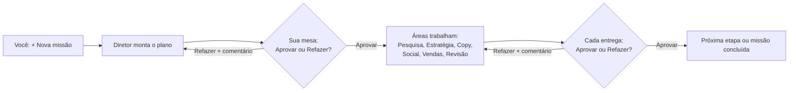

# Escritório de IA

Painel em pixel art para tocar missões de vários projetos com uma equipe de agentes, um por área.
Você pede pelo painel, o Diretor divide o trabalho, cada área entrega um arquivo `.md` e **nada avança sem a sua aprovação**.
Nenhum agente publica, envia mensagem, gasta dinheiro ou altera arquivos fora desta pasta.

## Como funciona



1. **Pedido:** no painel, clique em **+ Nova missão**, escolha o projeto e escreva o que você quer.
2. **Plano:** o servidor chama o Claude Code sozinho (sem janela). O Diretor cria o briefing do projeto se ele não existir, divide a missão em partes por área e manda o plano para a sua fila.
3. **Aprovação:** em **Aguardando sua aprovação**, leia a entrega e clique em **Aprovar** ou em **Refazer**, escrevendo o que deve mudar.
4. **Execução:** cada aprovação acorda o Claude de novo, e as missões liberadas rodam. Uma missão só começa quando o plano e as missões de que ela depende estão aprovados.
5. **Ação externa:** publicar, enviar ou mexer em outro projeto só acontece quando você pede explicitamente ("execute a m-XXX") e a missão está aprovada.

## A equipe

| Agente | Sala | Faz | Pasta das entregas |
|---|---|---|---|
| Diretor | Diretoria | divide a missão, define ordem, dependências e XP | `diretor/` |
| Pesquisador | Pesquisa | mercado, concorrentes, público, palavras-chave, sempre com fontes | `pesquisa/` |
| Estrategista | Estratégia | posicionamento, ângulo da campanha, funil, metas, SEO | `estrategia/` |
| Copywriter | Copy | textos de site, anúncios, e-mails e roteiros, com variações | `copy/` |
| Social | Social | posts, legendas, roteiros de vídeo e calendário (não publica) | `social/` |
| Vendas | Vendas | prospects, rascunhos de mensagens, propostas e follow-ups (não envia) | `vendas/` |
| Revisor | Revisão | nota por critério, erros, riscos e o que falta antes de chegar até você | `revisor/` |

As instruções completas de cada agente ficam em `.claude/agents/`, e as regras gerais em `CLAUDE.md`.

## O painel

- **Escritório:** planta vista de cima, com uma sala por área. O agente digita e mostra um balão "..." quando está trabalhando.
- **Linhas tracejadas** saem da Diretoria: amarelas para as salas com trabalho em andamento, rosa para as que têm entrega esperando por você.
- **Clique numa sala** para ver a ficha do agente: papel, nível, XP e entregas recentes.
- **Memória:** reúne os briefings dos projetos e as entregas já aprovadas.
- **Topo:** Entregues, XP, Nível e o status do Claude (parado, trabalhando ou erro).
- **Missões:** aba com a lista de todas as missões, com filtro por status.
- **XP:** cada missão vale um XP, que só conta depois de aprovada. A cada 100 XP o nível sobe.
- **Atualização:** o painel relê o `estado.json` a cada 3 segundos, sem recarregar a página.

## Requisitos

- [Node.js](https://nodejs.org) 18 ou mais novo. Não há dependências nem `npm install`.
- [Claude Code](https://claude.com/claude-code) instalado e logado: o comando `claude` precisa funcionar no terminal.
- Git, para clonar e salvar alterações.

## Instalação em outro PC

```powershell
git clone https://github.com/Tulin26/escritorio-ia.git
cd escritorio-ia
npm start
```

Abra **http://localhost:4321** e deixe a janela do terminal aberta (fechar a janela desliga o painel).

## Status das missões

| Status | Significado |
|---|---|
| `backlog` | criada pelo Diretor, esperando o plano ou as dependências serem aprovados |
| `rodando` | um agente está trabalhando nela |
| `aguardando` | entrega pronta, esperando você no painel |
| `aprovado` | você aprovou; o XP passa a contar |
| `refazer` | você pediu mudança; o agente lê o comentário e refaz no mesmo arquivo |

## Dados (`estado.json`)

| Campo | Conteúdo |
|---|---|
| `agentes` | `id`, `nome`, `area`, `sala`, `papel` (texto da ficha) e `origem` |
| `projetos` | `id`, `nome`, `briefing` (arquivo em `projetos/`) |
| `pedidos` | o que você pediu pelo painel: `id` (p-001…), `projeto`, `texto`, `status` (novo ou feito), `missao` (plano criado) e `data` |
| `missoes` | `id` (m-001…), `projeto`, `area`, `agente`, `titulo`, `resumo` (com "depende de"), `arquivo`, `status`, `xp`, `data` e `comentario` |

Datas no formato `AAAA-MM-DD HH:MM`. Missões com `"exemplo": true` são só demonstração e são ignoradas pela automação.

## Estrutura

| Caminho | O que é |
|---|---|
| `server.js` | servidor do painel (rotas da API) e automação das rodadas |
| `index.html`, `style.css`, `app.js` | painel pixel art (HTML, CSS e JavaScript puros) |
| `estado.json` | agentes, projetos, pedidos e missões |
| `CLAUDE.md` | regras do escritório e protocolo de trabalho |
| `.claude/agents/` | instruções de cada agente |
| `projetos/` | briefing de cada projeto (`_modelo.md` é o modelo) |
| `diretor/` … `revisor/` | entregas de cada área |
| `logs/` | registro de cada rodada automática (fora do Git) |

### API do servidor

| Rota | Para quê |
|---|---|
| `GET /api/estado` | estado atual e status da automação |
| `GET /api/arquivo?id=m-001` | conteúdo do `.md` de uma missão |
| `POST /api/pedido` | nova missão (`{ projeto, texto }`) |
| `POST /api/decisao` | aprovar ou refazer (`{ id, acao, comentario }`) |
| `POST /api/rodada` | pedir uma rodada agora |

O servidor só aceita conexões do próprio computador (`127.0.0.1` e `::1`).

## Configuração

| Variável | Padrão | Para quê |
|---|---|---|
| `PORT` | `4321` | porta do painel |
| `ESCRITORIO_AUTOMACAO` | ligada | `0` desliga as rodadas automáticas |
| `ESCRITORIO_MODELO` | `claude-opus-5-5` | modelo usado nas rodadas |
| `ESCRITORIO_ESFORCO` | `high` | nível de esforço das rodadas |
| `CLAUDE_BIN` | `claude` | caminho do Claude Code, se não estiver no PATH |

Exemplo: `$env:PORT=4322; npm start`

Cada rodada gasta uso do seu plano do Claude. Com o modelo e o esforço padrão, uma rodada pode levar vários minutos.
Nas rodadas, o Claude não tem acesso ao terminal, só grava dentro desta pasta e para sozinho depois de 30 minutos.

## Problemas comuns

| Sintoma | Solução |
|---|---|
| O navegador não conecta | o servidor está desligado: rode `npm start` na pasta e deixe a janela aberta |
| "A porta 4321 já está em uso" | já existe outro servidor aberto; feche a outra janela ou use `$env:PORT=4322; npm start` |
| Status do Claude em "erro" | abra o arquivo indicado em `logs/` e confira se `claude` funciona no terminal; depois clique em **Tentar de novo** |
| Missão parada em `backlog` | ela espera o plano do Diretor e as missões de "depende de" serem aprovados |

## Salvar alterações no GitHub

```powershell
git add -A
git commit -m "o que mudou"
git push
```

## Créditos

Os agentes foram adaptados do projeto open source [ECC](https://github.com/affaan-m/ECC).
